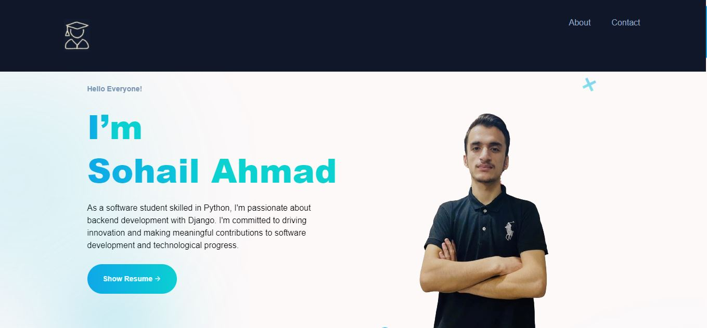

## Dynamic Portfolio

Welcome to my dynamic Django portfolio! Using Django, I've created a user-friendly platform to showcase my projects and certifications. Easily manage certifications with an intuitive admin interface, adding, editing, or removing details like certification name and offer by. Explore my projects section, where you'll find detailed descriptions, technologies used, and links to GitHub. Keeping my portfolio up-to-date is easy thanks to Django's admin interface. Plus, it looks great on any device with responsive design. Filter projects by tech stack or type for easy browsing. Navigation is smooth, even with lots of projects.  Explore and enjoy a seamless user experience!

## Overview



## Installation

Install my-project
 
## Step 1:
Create a vitual environment for the project, 
before creating virtual env create a directory 

```bash
  mkdir portfolio
  cd portfolio
```
## Create virtual env ( bash ) 
To create virtual environment, install python3-venv package

To install run the following Command in terminal

```bash
  sudo apt install python3-venv
```

After installing run the following command to create and as well as activate the vitual env
```bash
  python3 venv -m myenv
  source myenv/bin/activate
```

## Step 2:
Run the following command to clone my project

```bash
  git clone https://github.com/Sohail342/Portfolio
```

## Step 3:
cd to project

```bash
  cd Portfolio
```

## Step 4:
install the dependency packags, to install run the following command

```bash
  pip3 install -r requirements.txt
```
Make sure you are in correct directory


## Step 5:
Run the Local server to test your project

```bash
  python3 manage.py runserver
```


## Contact
If you have any questions or feedback, feel free to reach out:
<p align="left">
<a href="https://wa.me/+923428041928" target="blank"></a>
<a href="https://www.hackerrank.com/sohail_ahmad342" target="blank"></a>
<a href="https://www.linkedin.com/in/sohailahmad3428041928/" target="blank"></a>
<a href="https://instagram.com/sohail_ahmed113" target="blank"></a>
<a href="mailto:sohailahmed34280@gmail.com" target="blank"></a>
</p>
